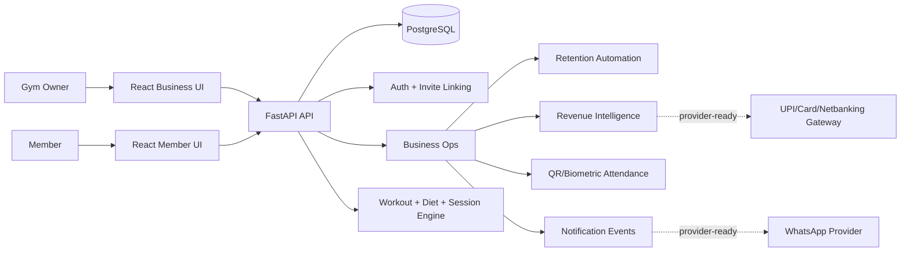

# FitGen.ai

FitGen.ai is a production-oriented gym operating system for retention, renewals, and member coaching. It is built for Indian gyms where the owner often runs sales, coaching, collections, and member follow-up from one desk.

The core operating question is simple:

> Which members need action today, and what should the gym team do next?

FitGen.ai combines a FastAPI backend, multi-tenant business data, a modern React dashboard, retention automation, workout/session tooling, and provider-ready WhatsApp/payment workflows.

## Product Highlights

- **Business OS for gyms:** organizations, roles, members, staff, plans, memberships, payments, attendance, goals, audit logs, and notifications.
- **Indian-market retention automation:** 7-day QR/biometric silent-dropout alarms, WhatsApp-ready nudges, and renewal funnels at 15, 7, and 3 days before expiry.
- **Owner-led workflow:** gyms can operate without a trainer team; actions fall back to owner/admin when no trainer is assigned.
- **Member account activation:** owners create member profiles first, then invite members to activate login accounts from a secure invite link.
- **Revenue operations:** active memberships, MRR run-rate, unpaid members, expiring memberships, renewal trends, and revenue at risk.
- **Coaching layer:** adaptive workout plans, live workout sessions, readiness check-ins, diet planning, feedback, goals, and transformation tracking.
- **Production posture:** Render-ready backend, Vercel-ready frontend, Docker support, Alembic migrations, CI workflow, CORS/env-driven deployment, and production demo-route gating.

## Tech Stack

| Layer | Technology |
| --- | --- |
| Backend | FastAPI, SQLAlchemy, Pydantic, Alembic |
| Database | PostgreSQL in production, SQLite for local demos |
| Frontend | React, Vite, TypeScript, Tailwind, TanStack Query |
| Deployment | Render backend, Vercel frontend, Docker optional |
| Auth | PBKDF2 password hashing, bearer sessions, logout revocation, member invite activation |
| Automation | Retention workflows, notification events, WhatsApp/payment-link-ready metadata |

## Repository Map

```text
app/
  main.py                  FastAPI app, auth, member invite acceptance, legacy member APIs
  models.py                SQLAlchemy domain models
  schemas.py               Pydantic API contracts
  routes/                  organization, business, trainer, audit, analytics, notification routes
  services/                auth, tenancy, business ops, analytics, planner, notifications
frontend-modern/           Production React/Vite application
frontend/                  Older static frontend kept for compatibility/reference
migrations/                Alembic schema migrations
render.yaml                Render deployment blueprint
Dockerfile                 Backend Docker image
docker-compose.yml         Local full-stack pilot setup
```

## Key Workflows

### 1. Gym Owner Onboarding

1. Owner creates a business workspace.
2. Owner adds membership plans.
3. Owner creates members with phone/email/member code.
4. Owner invites members to activate their own login.
5. Dashboard begins tracking renewals, attendance gaps, actions, and revenue.

### 2. Silent Dropout Alarm

If an active member has no QR or biometric attendance scan for 7 consecutive days, FitGen.ai creates a high-priority action:

- assigned to trainer if available;
- otherwise assigned to owner/admin;
- tagged as `silent_dropout`;
- marked WhatsApp-ready when member phone exists;
- safe fallback when phone is missing.

### 3. Renewal Funnel

For active memberships expiring in 15, 7, or 3 days, FitGen.ai creates renewal actions with:

- membership and plan metadata;
- amount and currency;
- supported payment method intent: UPI, card, netbanking;
- payment-link status;
- WhatsApp template metadata for future provider delivery.

### 4. Member Activation

Owners do not need a member password at creation time. They create the member profile, then generate an invite link. The member accepts the invite, sets a password, and gets linked to the existing gym-scoped profile.

This preserves business data continuity while giving members a real login.

## API Highlights

### Health and Auth

- `GET /api/health`
- `POST /api/auth/signup`
- `POST /api/auth/login`
- `POST /api/auth/logout`
- `GET /api/auth/member-invite/{token}`
- `POST /api/auth/member-invite/accept`

### Organization Operations

- `GET /api/organizations`
- `POST /api/organizations`
- `GET /api/organizations/{organization_id}/members`
- `POST /api/organizations/{organization_id}/members`
- `GET /api/organizations/{organization_id}/members/{member_id}/detail`
- `POST /api/organizations/{organization_id}/members/{member_id}/invite`
- `POST /api/organizations/{organization_id}/attendance/import`
- `POST /api/organizations/{organization_id}/membership-plans`
- `POST /api/organizations/{organization_id}/members/{member_id}/memberships`
- `POST /api/organizations/{organization_id}/members/{member_id}/payments`
- `POST /api/organizations/{organization_id}/members/{member_id}/attendance`

### Business Intelligence

- `GET /api/organizations/{organization_id}/business/dashboard`
- `GET /api/organizations/{organization_id}/business/actions/today`
- `PATCH /api/organizations/{organization_id}/business/actions/{workflow_id}`
- `GET /api/organizations/{organization_id}/business/retention/forecast`
- `GET /api/organizations/{organization_id}/business/retention/renewal-risk`
- `GET /api/organizations/{organization_id}/business/revenue`
- `GET /api/organizations/{organization_id}/business/trainers/performance`
- `GET /api/organizations/{organization_id}/business/transformations/gym`

### Member Coaching

- `GET /api/users/{user_id}/dashboard`
- `POST /api/users/{user_id}/plans/weekly`
- `POST /api/users/{user_id}/sessions/start`
- `GET /api/users/{user_id}/sessions/active`
- `POST /api/sessions/{session_id}/exercises/{session_exercise_id}/sets`
- `POST /api/sessions/{session_id}/finish`
- `POST /api/users/{user_id}/feedback`

## Local Development

Backend:

```bash
pip install -r requirements.txt
alembic upgrade head
uvicorn app.main:app --reload
```

Frontend:

```bash
cd frontend-modern
npm install
npm run dev
```

Windows helper:

```powershell
powershell -ExecutionPolicy Bypass -File .\run-fitgen.ps1 8010
```

## Environment Variables

Backend:

```text
APP_ENV=production
DATABASE_URL=<postgres-url>
AUTO_CREATE_TABLES=false
ENABLE_DEMO_ROUTES=false
ALLOWED_ORIGINS=https://your-vercel-app.vercel.app
SESSION_TTL_HOURS=168
FRONTEND_APP_URL=https://your-vercel-app.vercel.app
```

Provider-ready automation flags:

```text
WHATSAPP_AUTOMATION_ENABLED=false
PAYMENT_LINKS_ENABLED=false
BOOKING_BASE_URL=https://your-vercel-app.vercel.app/book
PAYMENT_LINK_BASE_URL=<payment-provider-link-base>
```

LLM enrichment is optional:

```text
LLM_PROVIDER=groq
GROQ_API_KEY=<stored only in hosting env vars>
LLM_BASE_URL=https://api.groq.com/openai/v1
LLM_MODEL=openai/gpt-oss-20b
```

Frontend:

```text
VITE_API_BASE_URL=https://your-render-api.onrender.com
```

## Deployment

Recommended private-pilot stack:

- **Backend:** Render web service.
- **Database:** Render Postgres, Neon, or Supabase Postgres.
- **Frontend:** Vercel from `frontend-modern`.

Render start command:

```bash
alembic upgrade head && uvicorn app.main:app --host 0.0.0.0 --port ${PORT:-8000}
```

Health check:

```http
GET /api/health
```

Expected response:

```json
{"status":"ok","service":"FitGen AI"}
```

## Verification

Backend:

```bash
python -m compileall app
alembic heads
```

Frontend:

```bash
cd frontend-modern
npm run lint
npm run build
```

Important smoke tests:

- Login and logout.
- Business signup and workspace creation.
- Create member with phone/email.
- Generate member invite and accept it.
- Create membership ending in 15, 7, or 3 days.
- Record/import QR or biometric attendance.
- Verify daily actions create dropout and renewal workflow items.
- Complete or dismiss an action from the business UI.

## Security and Privacy

FitGen.ai handles sensitive health, attendance, and payment-adjacent data. Production rules:

- Keep secrets in hosting environment variables only.
- Never commit API keys, database URLs, or payment provider credentials.
- Keep demo routes disabled in production.
- Scope every organization route by `organization_id` and role.
- Use Alembic migrations for schema changes.
- Do not mark WhatsApp/payment delivery as live until provider webhooks are connected and verified.

## Architecture



## Roadmap

- Real WhatsApp provider adapter with approved templates and delivery status.
- Payment gateway adapter with UPI/card/netbanking links and webhook verification.
- Background scheduler for daily automation runs.
- Password reset and stronger rate limiting.
- Tenant-isolation test coverage for every organization route.
- Audit-log UI and data export/deletion workflows.
- Error monitoring and database backup/restore playbook.

## Why This Project Matters

Most small and mid-size gyms lose revenue silently: members stop attending, renewals are tracked manually, and owners discover churn too late. FitGen.ai turns those signals into daily operational actions, designed for the way real gyms work in India.
